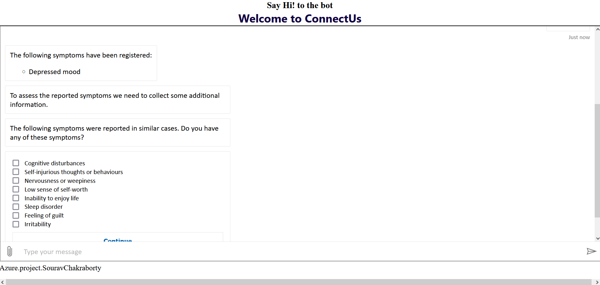

## Azure Chat service For Health Diagnostics

## Overview

## Problem Statement
Increased demand for health care has produce overhead for healthcare professionals. Website for health service could include health bots which would reduce this overhead. Medical bots would help reducing hospital visits, unnecessary treatments and procedures, and decreasing hospital admissions as knowledge about their symptoms improve. For patients, this comes with a lot of benefits: less time spent commuting to the doctor’s office, less money spent on unnecessary treatments.
People can now easily provide their symptoms and get a rough diagnosis of their disease, just by chatting with the bot.

## Project Description

The Project intregates a bot which is made with Azure Health Bot in a static website which help end users to equire about their diseases and symptoms.

The following resources needs to be configured :

   Azure Components | Description
   -----------------|------------
   Azure Web Apps   | Azure Web Apps are Microsoft's offering to cloud to host web applications
   Azure Health Bot | Empowers healthcare organizations to build and deploy intelligent and compliant virtual health
   Azure Application Insights   | Application Insights can monitor Azure cloud service apps for availability, performance, failures, and usage

Following  components are provisioned in resource Group: ConnectUs

  * Azure Application Insights
  * Azure Health Bot
  * App Service Plan
  * Azure Web App
  * Azure Key Vault

## Setting up the Environment

*Azure Health bot*
1. Create Azure resource from create resource and navigate to Azure Health Bot.
2. We select the Resource group and allocate name, region and the plan to it. 
 3. Now we click on Review + Create
5. And then Press Create to deploy the bot.

*Creating website to host Azure Bot*

1. We create an node.js with Express.js Application, which includes an Html File. 
2. We Create an html file (index.html) and the embed code with secret key. (connectushealthbot-rv9wxtx?s=PgUgfnEB4Lk.40hRnW2vtC0taw6VseaUFSZSShK-cbtazCA6zkW7hvk) found from Azure Health Bot portal under integration tab.

*Web App Service*

1. We search the Web App Service and click on Create.
2. Select the Resource Group and the Web App name.
3. Select the Runtime stack to NODE 16(LTS).
4. Select the region and the App Service Plan.
5. Click on Review + Create and Create the Web App.
6. In deployment centre we used Github action to build and deploy the website. 

## Enabling App Insights

Azure Application Insights is been added which can monitor Azure cloud service apps for availability, performance, failures, and usage by combining data . It would be necessary  for monitoring multiple web app services which is hosted by this bot.

1. We enabled Application Insights for the Azure Web App Service.

## We successfully hosted our website
 

Link: https://connectuswebapp.azurewebsites.net/

## Summary

With Azure Health Bot, Azure Web App and Azure Application Insights, we have configured a Heath bot service which has capability to diagnose a disease by knowing its symptoms.
